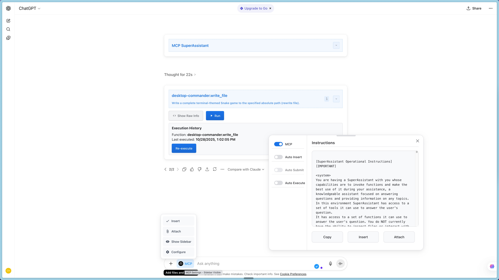
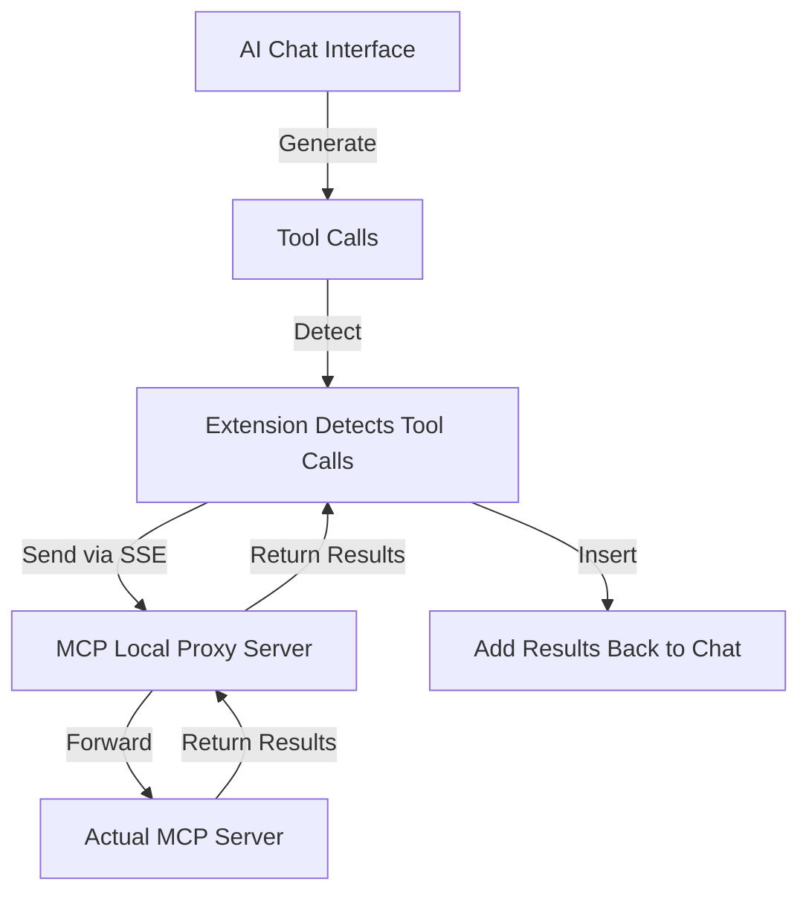

<div align="center">
   <!--  -->
   <h1>MCP SuperAssistant Chrome Extension</h1>
</div>

<p align="center">
Brings MCP to ChatGPT, Perplexity, Grok, Gemini, Google AI Studio, OpenRouter, Kimi, Github Copilot, Mistral and more...
</p>

<p align="center">
   <a href="https://mcpsuperassistant.ai/" target="_blank"><strong>🌐 Visit Official Website</strong></a>
</p>

<!--  -->
<div align="center">
 
</div>

<div align="center">
   
   
   
   
   
   
   

</div>

## Installation

<div align="center" style="display: flex; justify-content: center; gap: 20px; align-items: center;">
   <a href="https://chromewebstore.google.com/detail/mcp-superassistant/kngiafgkdnlkgmefdafaibkibegkcaef?hl=en"></a>
   <a href="https://addons.mozilla.org/en-US/firefox/addon/mcp-superassistant/"></a>
</div>

<br>

## Overview

MCP SuperAssistant is a Chrome extension that integrates the Model Context Protocol (MCP) tools with AI platforms like Perplexity, ChatGPT, Google Gemini, Google AI Studio, Grokand more. It allows users to execute MCP tools directly from these platforms enhancing the capabilities of web-based AI assistants.

## Currently Supported Platforms

- [ChatGPT](https://chatgpt.com/)
- [Google Gemini](https://gemini.google.com/)
- [Perplexity](https://perplexity.ai/)
- [Grok](https://grok.com/)
- [Google AI Studio](https://aistudio.google.com/)
- [OpenRouter Chat](https://openrouter.ai/chat)
- [DeepSeek](https://chat.deepseek.com/)
- [T3 Chat](https://t3.chat/)
- [GitHub Copilot](https://github.com/copilot)
- [Mistral AI](https://chat.mistral.ai/)
- [Kimi](https://kimi.com/)
- [Qwen Chat](https://chat.qwen.ai/)
- [Z Chat](https://chat.z.ai/)


## Demo Video

Kimi.com

[](https://www.youtube.com/watch?v=jnBPh2jzunM)

ChatGPT

[](https://www.youtube.com/watch?v=PY0SKjtmy4E)

Watch the demo to see MCP SuperAssistant in action!

[MCP SuperAssistant Demo Playlist](https://www.youtube.com/playlist?list=PLOK1DBnkeaJFzxC4M-z7TU7_j04SShX_w)

## Setup Tutorial

[](https://www.youtube.com/watch?v=h9f_GX1Ef20&pp=ygUTbWNwIHN1cGVyIGFzc2lzdGFudA%3D%3D)

**New to MCP SuperAssistant?** Watch this complete setup guide to get started in minutes!

[View Setup Tutorial](https://www.youtube.com/watch?v=h9f_GX1Ef20&pp=ygUTbWNwIHN1cGVyIGFzc2lzdGFudA%3D%3D)

## What is MCP?

The Model Context Protocol (MCP) is an open standard developed by Anthropic that connects AI assistants to systems where data actually lives, including content repositories, business tools, and development environments. It serves as a universal protocol that enables AI systems to securely and dynamically interact with data sources in real time.

## Key Features

- **Multiple AI Platform Support**: Works with ChatGPT, Perplexity, Google Gemini, Grok, Google AI Studio, OpenRouter Chat, DeepSeek, Kagi, T3 Chat, GitHub Copilot, Mistral AI, Kimi, Qwen Chat, Z Chat and more
- **Tool Detection**: Automatically detects MCP tool calls in AI responses
- **Tool Execution**: Execute MCP tools with a single click
- **Tool Result Integration**: Seamlessly insert tool execution results back into the AI conversation
- **Render Mode**: Renders Function call and Function results. 
- **Auto-Execute Mode**: Automatically execute detected tools
- **Auto-Submit Mode**: Automatically submit chat input after result insertion
- **Push Content Mode**: Option to push page content instead of overlaying
- **Preferences Persistence**: Remembers sidebar position, size, and settings
- **Dark/Light Mode Support**: Adapts to the AI platform's theme



### Connecting to Local Proxy Server

To connect the Chrome extension to a local server for proxying connections:

#### Run MCP SuperAssistant Proxy via npx:

1. Create a `config.json` file with your MCP server details. For example, to use the [Desktop Commander](https://github.com/wonderwhy-er/DesktopCommanderMCP):


   **Example config.json:**
   ```json
   {
     "mcpServers": {
       "desktop-commander": {
         "command": "npx",
         "args": [
           "-y",
           "@wonderwhy-er/desktop-commander"
         ]
       }
     }
   }
   ```
   config.json also support other MCP server configurations like remote MCP server URLs.
   Try composio mcp, zappier mcp, or smithery or any other remote MCP server.

   **Or use existing config file location from Cursor or other tools:**
   ```
   macOS: ~/Library/Application Support/Claude/claude_desktop_config.json
   Windows: %APPDATA%\Claude\claude_desktop_config.json
   ```

2. Start the MCP SuperAssistant Proxy server using one of the following commands:

   ```bash
   npx -y @srbhptl39/mcp-superassistant-proxy@latest --config ./config.json --outputTransport sse
   ```
   or 
   ```bash
   npx -y @srbhptl39/mcp-superassistant-proxy --config ./config.json --outputTransport streamableHttp
   ```
   or
   ```bash
   npx -y @srbhptl39/mcp-superassistant-proxy --config ./config.json --outputTransport ws
   ```

   **View all available options:**
   ```bash
   npx -y @srbhptl39/mcp-superassistant-proxy@latest --help
   ```
   
   This is useful for:
   - Proxying remote MCP servers
   - Adding CORS support to remote servers
   - Providing health endpoints for monitoring

#### Connection Steps:

1. Start the proxy server using one of the commands above
2. Open the MCP SuperAssistant sidebar in one of the supported AI platforms, this should show the sidebar UI
3. Click on the server status indicator (usually showing as "Disconnected")
4. Enter the local server URL (default: `http://localhost:3006/sse`)
   URL format depends on the --outputTransport method used:
   - For SSE: `http://localhost:3006/sse`
   - For Streamable HTTP: `http://localhost:3006/mcp`
   - For WebSocket: `ws://localhost:3006/message`
   - Choose the appropriate transport method (SSE or Streamable HTTP or WebSocket) 
   - You can add any remote MCP server URL here as well, if it supports CORS or is proxied via this local proxy server. Try [Composio mcp](https://mcp.composio.dev/), [Zappier mcp](https://zapier.com/mcp), or [smithery](https://smithery.ai/) or any other remote MCP server.
5. Click "Connect" to establish the connection
6. The status indicator should change to "Connected" if successful

## Usage
Example Workflow:
1. Navigate to a supported AI platform example chatgpt.
2. The MCP SuperAssistant sidebar will appear on the right side of the page
3. Configure your MCP Tools to enable and disable the tools you want to use.
4. In the message prompt area, hover the 'MCP' button to see the available tools and their descriptions.
5. MCP SuperAssistant requires to add an MCP working instructions prompt to the chat, to give details of its new capabilities and how to use the tools. Use the 'Insert' or attach button to add the instructions prompt.
6. Once the instructions prompt is added, Now you can ask it to read files or any related MCP tool operations.
7. When AI wants to use any tool it will show a custom tool call card with the tool name and parameters.
8. User can manually execute the tool call by clicking on the "RUN" button on the tool call card, or if Auto-Execute mode is enabled, it will execute automatically.
9. Automation can be achieved by enabling Auto-Execute and Auto-Submit modes, by clicking on the 'MCP' button and configuring the Auto modes.


## Tips & Tricks

1. **Turn off search mode** (chatgpt, perplexity) in AI chat interfaces for better tool call prompt experience and to prevent MCP SuperAssistant from getting derail.
2. **Turn on Reasoning mode** (chatgpt, perplexity, grok) in AI chat interfaces, which will help the AI to understand the context better and generate the correct tool calls.
3. Use newer high-end models as they are better at understanding the context and generating the correct tool calls.
4. Copy the MCP instructions prompt and paste it in the AI chat system prompt (Google AI Studio).
5. Mention the specific tools you want to use in your conversation.
6. Use the MCP Auto toggles to control the tool execution.

## Common Issues with MCP SuperAssistant

This page covers the most common issues users encounter with MCP SuperAssistant and provides solutions to resolve them.

### 1. Extension Not Detecting Tool Calls

- Make sure the extension is enabled in your browser.
- Make sure the **mcp prompt instructions are properly attached or inserted** in the chat, before starting any chat.
- Check that your AI platform supports tool calls and that the feature is enabled.
- Refresh the page or restart your browser if the issue persists.

### 2. Tool Execution Fails

- Ensure your proxy server is running and the URL is correct in the sidebar server settings.
- check your config.json file for any errors or formatting issues.
- Check your network connectivity and firewall settings.

### 3. Connection Issues

- Ensure that your MCP server is running and accessible.
- Check the server URL in the extension settings.
- First start the npx mcp-SuperAssistant-proxy server and then reload/restart the extension from chrome://extensions/ page.
- Check the proxy server logs for any errors or issues.
- Ensure that your firewall or antivirus software is not blocking the connection.
- Make sure the server shows the proper connected status and exposes the `/sse` endpoint.

### 4. Incorrect tool call format 

- There are times model does not generate correct tool call format as requested, this makes the tool detection to fail.
In such cases, use better models which are meant for tool calling or have better tool calling capabilities.
- Use the custom instructions prompt, which can be found in the MCP SuperAssistant sidebar.
- Ask explicitily to use the tools by mentioning them in the prompt.
- This Below is an example of correct MCP function call format, which is rendered by MCP SuperAssistant extension:

```
```jsonl
{"type": "function_call_start", "name": "function_name", "call_id": 1}
{"type": "description", "text": "Short 1 line of what this function does"}
{"type": "parameter", "key": "parameter_1", "value": "value_1"}
{"type": "parameter", "key": "parameter_2", "value": "value_2"}
{"type": "function_call_end", "call_id": 1}
```
```

### Manual Installation (Development)

#### Release Version
1. Download the latest release from [Releases](https://github.com/srbhptl39/MCP-SuperAssistant/releases)
2. Unzip the downloaded file
3. Navigate to `chrome://extensions/` in Chrome
4. Enable "Developer mode"
5. Click "Load unpacked" and select the unzipped directory
6. Follow [Connecting to Local Proxy Server](#connecting-to-local-proxy-server) to connect to your MCP server

## Development

### Prerequisites

- Node.js (v16+)
- pnpm

### Setup

```bash
# Install dependencies
pnpm install

# Start development server
pnpm dev

# Build for production
pnpm build

# Create zip package for distribution
pnpm zip
```

## Contributing

Contributions are welcome! Please feel free to submit a Pull Request.

1. Fork the repository
2. Create your feature branch (`git checkout -b feature/amazing-feature`)
3. Commit your changes (`git commit -m 'Add some amazing feature'`)
4. Push to the branch (`git push origin feature/amazing-feature`)
5. Open a Pull Request

## Author

### [Saurabh Patel](https://github.com/srbhptl39)

## Sponsor & Support

This project is developed entirely in my spare time, driven by a passion for AI and the Model Context Protocol (MCP). As a full-time professional, balancing work commitments with open-source development makes it challenging to contribute regularly and maintain the pace of updates.

Your support helps me dedicate more time to:
- 🐛 Fixing bugs and addressing issues
- ✨ Adding new features and platform support
- 📚 Improving documentation and tutorials
- 🔄 Keeping dependencies up-to-date
- 💬 Responding to community requests

**Support this project:**
- ⭐ Star the repository to show your appreciation
- 💖 [Sponsor on GitHub](https://github.com/sponsors/srbhptl39) to help sustain development
- 🐦 Follow me on [Twitter](https://twitter.com/srbhptl39) (@srbhptl39) for updates
- 📧 For private support or custom implementations, reach out via [Twitter](https://twitter.com/srbhptl39)

Every contribution, big or small, helps keep this project alive and thriving! 🙏

## License

This project is licensed under the MIT License - see the LICENSE file for details.

## Acknowledgments

- Inspired by the [Model Context Protocol (MCP)](https://modelcontextprotocol.io/) by Anthropic
- Thanks to [Cline](https://github.com/cline/cline) for idea inspiration
- Built with [Chrome Extension Boilerplate with React + Vite](https://github.com/Jonghakseo/chrome-extension-boilerplate-react-vite)


## Star History

[](https://www.star-history.com/#srbhptl39/MCP-SuperAssistant&Date)
