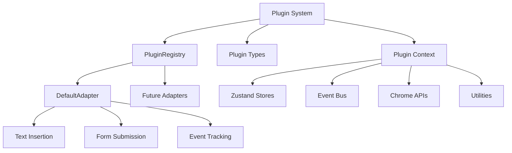

# Plugin System Core

This directory contains the core components for the MCP-SuperAssistant's plugin architecture, implementing a modern Zustand-based system for extensible website adapters.

## Overview

The plugin system provides a modular and extensible foundation that allows the assistant to adapt its behavior and capabilities based on the website it's currently active on. **Session 7 Implementation Complete ✅**

## Core Components

### `plugin-registry.ts` - PluginRegistry ✅
**Status**: Fully implemented with DefaultAdapter integration

The central hub for plugin management:
- **Registration**: Automatic registration of built-in adapters
- **Lifecycle Management**: Initialize, activate, deactivate, cleanup
- **Hostname Matching**: Intelligent adapter selection based on current site
- **Event Emission**: Real-time plugin status updates
- **Error Handling**: Comprehensive error recovery and logging
- **Cleanup**: Proper resource cleanup and memory management

Key features:
```typescript
class PluginRegistry {
  async initialize(context: PluginContext): Promise<void>
  async register(plugin: AdapterPlugin, config?: AdapterConfig): Promise<void>
  async activatePluginForHostname(hostname: string): Promise<void>
  async cleanup(): Promise<void>
  getActivePlugin(): AdapterPlugin | null
  getDebugInfo(): object
}
```

### `plugin-types.ts` - Type Definitions ✅
**Status**: Complete type system

Comprehensive TypeScript interfaces:
- `AdapterPlugin`: Core plugin contract
- `AdapterConfig`: Plugin configuration schema
- `PluginContext`: Runtime context for plugins
- `AdapterCapability`: Available plugin capabilities
- `PluginRegistration`: Internal registry structure

### `base.adapter.ts` - BaseAdapterPlugin ✅
**Status**: Foundation class implemented

Abstract base class providing:
- **Lifecycle Management**: Standard initialize/activate/deactivate/cleanup flow
- **Status Tracking**: Real-time plugin status monitoring
- **Event Integration**: Built-in event handling capabilities
- **Error Handling**: Standardized error logging and recovery
- **Utility Methods**: Common functionality shared across adapters

### `plugin-context.ts` - Context Provider ✅
**Status**: Context system implemented

Factory for creating plugin contexts:
- **Store Access**: Direct access to Zustand stores
- **Event Bus**: Type-safe event communication
- **Utilities**: Helper functions for DOM manipulation
- **Chrome APIs**: Extension API access
- **Logger**: Structured logging system

### `index.ts` - Plugin System Exports ✅
**Status**: Complete integration

Main export file providing:
- **Public API**: Clean interface for external usage
- **Initialization**: `initializePluginRegistry()` function
- **Cleanup**: `cleanupPluginSystem()` function
- **Development Tools**: Debug utilities for development

## Architecture



## Implementation Status

### ✅ **Completed (Session 7)**
- **Plugin Registry**: Full lifecycle management
- **DefaultAdapter**: Universal fallback adapter
- **Type System**: Complete TypeScript definitions
- **Context Provider**: Store and API access
- **Integration**: Automatic initialization
- **Event System**: Real-time status tracking
- **Error Handling**: Comprehensive error recovery
- **React Hooks**: Full component integration

### ✅ **Completed (Session 8)**
- **ExampleForumAdapter**: Site-specific adapter implementation
- **Plugin Registration**: Automatic built-in adapter registration
- **Event Integration**: Forum-specific event tracking
- **Documentation**: Complete adapter documentation

### 🔄 **In Progress**
- **Testing**: Unit and integration tests
- **Migration**: Legacy adapter integration

### 📋 **Planned (Session 9+)**
- **Additional Site Adapters**: Reddit, GitHub, Twitter, etc.
- **Dynamic Loading**: Runtime adapter discovery
- **Performance Monitoring**: Metrics and optimization
- **User Adapters**: User-defined plugin support

## Usage

### Basic Usage

```typescript
// Initialize the plugin system
import { initializePluginRegistry } from '@src/plugins';

await initializePluginRegistry();
```

### Using with React Hooks

```typescript
import { useCurrentAdapter } from '@src/hooks';

function MyComponent() {
  const { insertText, submitForm, capabilities, isReady } = useCurrentAdapter();
  
  const handleInsert = async () => {
    if (isReady) {
      const success = await insertText('Hello World!');
      console.log('Insert result:', success);
    }
  };
  
  return (
    <button onClick={handleInsert} disabled={!isReady}>
      Insert Text
    </button>
  );
}
```

### Creating Custom Adapters

```typescript
import { BaseAdapterPlugin } from '@src/plugins';

export class MySiteAdapter extends BaseAdapterPlugin {
  readonly name = 'MySiteAdapter';
  readonly version = '1.0.0';
  readonly hostnames = ['mysite.com'];
  readonly capabilities = ['text-insertion', 'form-submission'];
  
  async insertText(text: string): Promise<boolean> {
    // Site-specific implementation
    return true;
  }
  
  // ... other methods
}
```

## Event System

The plugin system emits various events for monitoring and integration:

```typescript
// Plugin lifecycle events
'plugin:registry-initialized'
'plugin:registered'
'plugin:activation-requested'
'adapter:activated'
'adapter:deactivated'
'adapter:error'

// Tool execution events
'tool:execution-started'
'tool:execution-completed'
'tool:execution-failed'
```

## Development Tools

### Debug Console

```javascript
// Access plugin system in browser console
window.__pluginSystem.getRegistry().getDebugInfo();
window.__pluginSystem.getRegistry().getActivePlugin();
```

### Performance Monitoring

```typescript
// Track plugin performance
import { performanceMonitor } from '@src/core/performance';

performanceMonitor.startTimer('plugin-activation');
await plugin.activate();
performanceMonitor.endTimer('plugin-activation');
```

## Configuration

### Registry Configuration

```typescript
const config: AdapterConfig = {
  id: 'my-adapter',
  name: 'My Adapter',
  description: 'Description',
  version: '1.0.0',
  enabled: true,
  priority: 10,
  settings: {
    logLevel: 'info'
  }
};
```

### Context Configuration

```typescript
const context = createPluginContext('my-adapter');
// Provides access to:
// - context.stores (Zustand stores)
// - context.eventBus (event communication)
// - context.utils (helper functions)
// - context.chrome (extension APIs)
// - context.logger (structured logging)
```

## Best Practices

### 1. **Error Handling**
Always wrap adapter operations in try-catch blocks and use proper logging.

### 2. **Event Emission**
Emit events for important operations to enable tracking and debugging.

### 3. **Resource Cleanup**
Implement proper cleanup in the `cleanupPlugin()` method.

### 4. **Type Safety**
Use TypeScript interfaces and avoid `any` types.

### 5. **Performance**
Minimize DOM queries and cache frequently accessed elements.

## Migration Guide

### From Legacy Adapters

```typescript
// Old way
const adapter = adapterRegistry.getAdapter(hostname);
adapter.initialize();

// New way
import { useCurrentAdapter } from '@src/hooks';
const { insertText, isReady } = useCurrentAdapter();
```

### Integration Steps

1. **Import Plugin System**: Add plugin system imports
2. **Initialize**: Call `initializePluginRegistry()`
3. **Use Hooks**: Replace direct adapter calls with hooks
4. **Event Handling**: Use event bus for communication
5. **Testing**: Verify functionality with debug tools

## Directory Structure

```
plugins/
├── README.md                    # This file
├── index.ts                     # Main exports
├── plugin-registry.ts           # Registry implementation
├── plugin-types.ts              # Type definitions
├── plugin-context.ts            # Context provider
├── base.adapter.ts              # Base adapter class
└── adapters/
    ├── README.md                # Adapter documentation
    ├── base.adapter.ts          # Base class
    └── default.adapter.ts       # Universal fallback
```

The plugin system is now production-ready and provides a solid foundation for extensible website adaptation capabilities.

This system provides a flexible way to extend the assistant's functionality for different websites.
